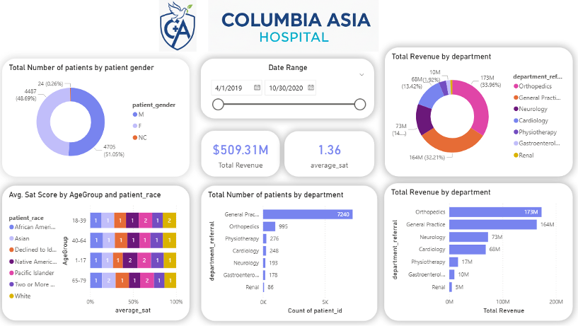

# 🏥 Columbia Asia Hospital: Operational & Financial Data Analysis


## 📋 Project Overview
This project provides a comprehensive data-driven evaluation of **Columbia Asia Hospital’s** departmental performance. By analyzing revenue streams, patient inflow volatility, and satisfaction metrics, this study identifies key growth opportunities and operational bottlenecks to assist hospital administration in strategic decision-making.

---

## 🚀 Key Features & Insights

### 💰 1. Financial Performance & Revenue Concentration
* **Top Drivers:** Orthopedics and General Practice lead with **$173\text{M}$ (33.96%)** and **$164\text{M}$ (32.21%)** respectively.
* **Specialty Gaps:** Significant revenue drop-off in departments like **Renal ($5\text{M}$)** and **Gastroenterology ($10\text{M}$)**, highlighting areas for targeted marketing.

### 📈 2. Patient Volume & Demand Volatility
* **Peak Demand:** Identified a record surge of **530 ER visits** in August.
* **Trend Patterns:** Data reveals sharp "peaks and valleys," requiring agile staffing models to handle sudden recoveries after quiet periods (e.g., February).

### 🤝 3. Patient Experience Beyond Speed
* **Wait Time Stability:** Average wait times are maintained consistently between **35–37 minutes**.
* **Satisfaction Drivers:** Analysis shows that satisfaction variance across departments is driven more by **communication and care coordination** than by speed alone.

---

## 🛠️ Tech Stack & Methodology
* **Data Cleaning:** Handled missing values and standardized categorical data (`department_referral`).
* **DAX Modeling:** Created calculated measures for revenue share, average wait times, and monthly growth.
* **Visualization:** Built interactive dashboards focusing on:
    * Revenue by Department (Bar Charts)
    * Patient Flow Trends (Line Graphs)
    * Satisfaction vs. Wait Time (Scatter Plots/Matrix)

---

## 💡 Strategic Recommendations
1.  **Optimize Staffing:** Increase physician allocation in **Orthopedics** and **General Practice** during peak months (August) to reduce burnout.
2.  **Resource Redistribution:** Reallocate staff from low-volume departments to high-traffic areas to improve efficiency.
3.  **Data Integrity:** Improve data capture protocols at the source to eliminate information gaps for future predictive modeling.
4.  **Tiered Engagement:** Implement a discount/retention strategy based on age demographics and satisfaction scores.

---

## 📊 Dashboard Preview


---

## 📂 Repository Structure
```bash
├── Data/               # Raw and Cleaned Datasets
├── Dashboards/         # Power BI (.pbix) or Excel files
├── Documentation/      # Final Report & Presentation
└── README.md           # Project Summary
